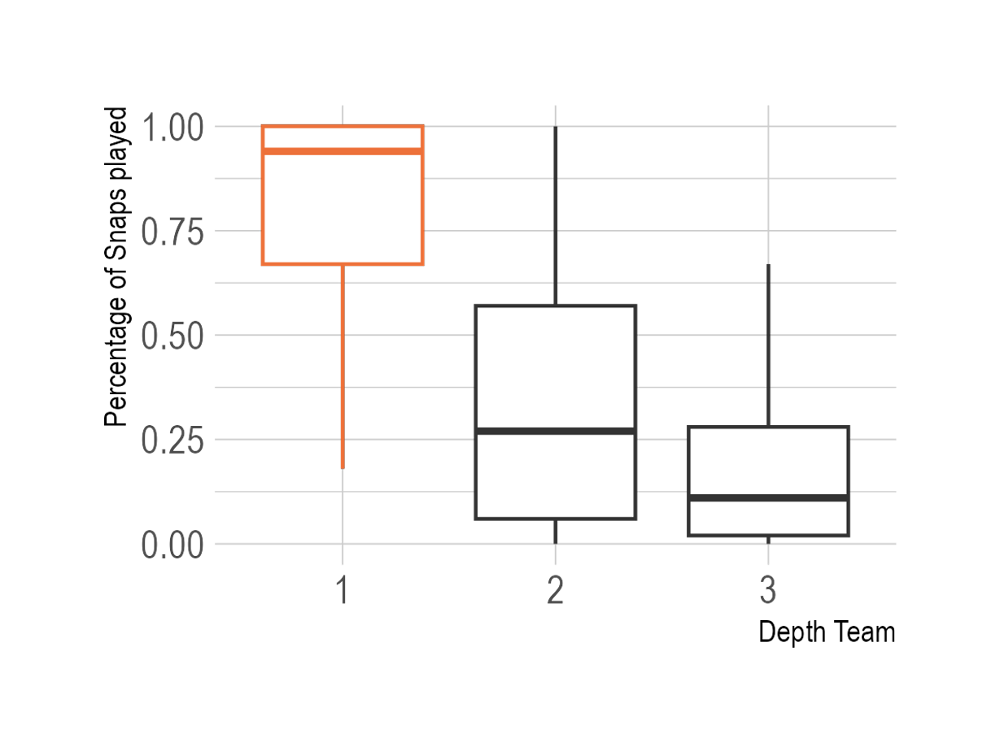
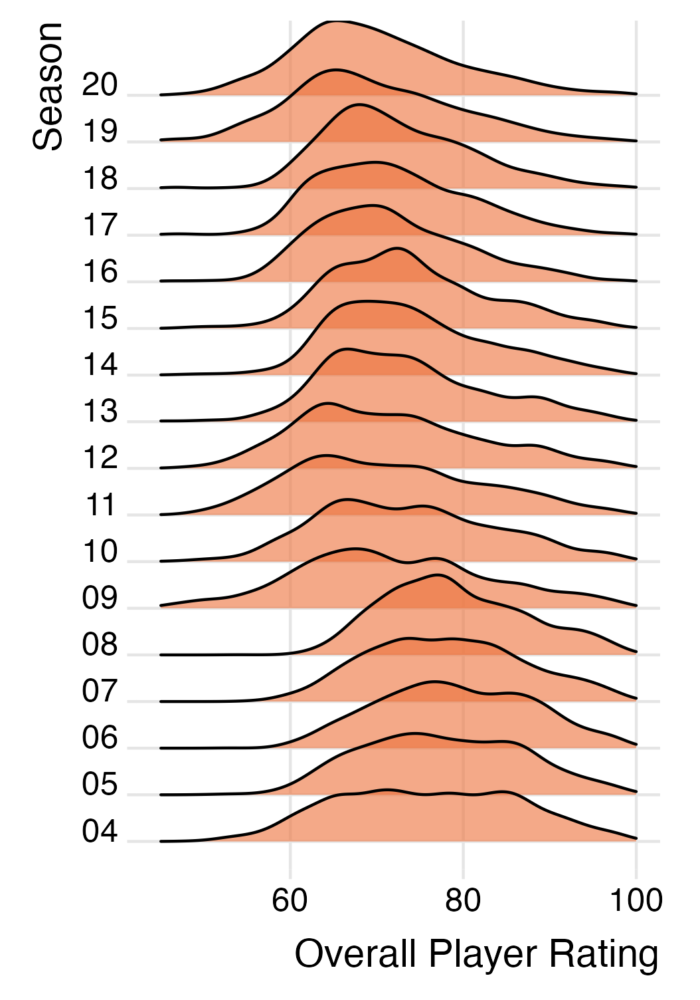

# Modelling the Game Outcome with Madden Player Ratings

This was my final project for the seminar "Statistics of the NFL", conducted by [Prof. Donna Ankerst](https://www.professoren.tum.de/ankerst-donna) in the winter semester 2022/23. As a passionate Eagles fan, this course quickly became one of my favorites during my master’s degree. It allowed me to explore my favorite sport through the perspective of machine learning.

## Motivation

The idea of using video games to predict the outcomes of sports matches was not new to me. As a child, my friend and I would predict soccer game results by playing the matchups in FIFA before watching them live. Oddly, our predictions always seemed to favor my friend’s favorite teams.

Putting childhood anecdotes aside, sports simulation games might actually have predictive power. Since 2004, EA Sports has been attempting to predict the Super Bowl outcome using its latest Madden NFL game, achieving a [success rate of 12 correct predictions out of the last 21](https://en.wikipedia.org/wiki/Madden_NFL). In particular, in-game player ratings could serve as a valuable addition to other available NFL data. While play-by-play data from the NFL is widely accessible through projects like nflverse, it remains challenging to attribute the outcome of a play to individual players. This is where Madden’s player ratings, which include attributes such as speed and strength, could provide a new dimension for analysis. 

In fact, [Fernandes et al.](https://content.iospress.com/download/journal-of-sports-analytics/jsa190348?id=journal-of-sports-analytics%2Fjsa190348) have already successfully utilized player ratings to predict offensive play types. So, why not use Madden player ratings to answer to the most pressing question in sports: which team will?

## Modelling Assumptions

While it is common practice to model game outcomes as a binary variable (win or loss), I believe that incorporating the actual scores provides a richer signal. For instance, a game ending 17-16 could easily have gone either way, while a 35-10 result clearly indicates a dominant performance by one team. However, this approach does add complexity, as it requires modeling two separate scores instead of a single binary variable.

To address this added complexity, I model the scores of each game separately by focusing on the matchups between the offense and defense. Specifically, I predict the score that the offense will achieve against a given defense. An added benefit of this approach is that it effectively doubles the number of training examples, as each game consists of two such matchups. However, this method also introduces some bias, as it assumes the performance of a team’s offense and defense are independent of each other. In reality, factors like momentum—where a successful offensive drive might positively influence defensive performance—can create interdependencies between the two.

            

## Challenges
### 1. Selecting relevant Player Ratings for each Games

On average, a Madden team consists of 66 players. However, not all players contribute equally to the team’s performance, so their ratings shouldn’t be weighted the same way. To accurately assess a team’s strength, one should focus on the key players — specifically, those with the best ratings for each position.

Football is a sport heavily impacted by injuries, where even a star player like the quarterback can be sidelined, drastically affecting team performance. It’s important to keep track of this, and fortunately, nflreadr provides weekly depth charts for each team. These charts rank players by position and prioritize them based on their likelihood of playing time.

Analyzing the data reveals that players listed as first-team depth (starters) participate in over 90% of the snaps on average. In contrast, second-team players see around 25% of the snaps, with even less playing time for those on the third team. Therefore, to simplify the analysis and focus on the most impactful players, I only consider those listed on the first depth team.



### 2. Handling Missing Data

Focusing on the player ratings of the first depth team, I tried to compute the average rating for each position. However, I encountered some missing values for certain positions. One issue is that Madden does not have a license for every player, leading to some gaps in the data. Additionally, when players are traded mid-season, it can be challenging to match them with the Madden player base.

To address these issues, I grouped positions into broader categories to minimize the impact of missing data. For example, I combined offensive tackle, offensive guard, and center into a single category called “offensive line.” Then, I calculated the average rating of players in the first depth team for each of these broader position groups.


### 3. Handling the Distribution Shift in Player Ratings

While player ratings in each version of Madden provide a good measure of how players compare to one another, I needed to ensure that these ratings were comparable across different versions of the game to train a model effectively. Upon examining the data, I noticed a shift in player ratings over time; overall, it appears that player ratings have generally declined over the years. To address this, rather than using the raw player ratings, I calculated the average rating for each position group by season and categorized them into four groups:

	1.	Ratings below the 1st quartile
	2.	Ratings between the 1st and 2nd quartiles
	3.	Ratings between the 2nd and 3rd quartiles
	4.	Ratings above the 3rd quartile
 



This script downloads Madden ratings data for a given range of years from `https://maddenratings.weebly.com/`. It stores the data as CSV files in a directory named `madden_data`.

## Installation

1. Clone the repository and navigate to its directory.

2. Create a Python virtual environment:

    ```bash
    python3 -m venv venv
    ```

3. Activate the virtual environment:

    On Unix or MacOS, run:
    
    ```bash
    source venv/bin/activate
    ```
    
    On Windows, run:
    
    ```cmd
    venv\Scripts\activate.bat
    ```

4. Install the required packages:

    ```bash
    pip install -r requirements.txt
    ```

## Usage

To run the script, use the following command, providing the years you want to download data for:

```bash
python madden_ratings_scraper.py --from 05 --to 20
```

Without any arguments, the script will default to downloading data for all years from 02 to the current year + 1:

```bash
python madden_ratings_scraper.py
```

To consolidate your downloaded data into a single, unified .csv file, you can utilize the `combine_madden_ratings.py` script. Execute this script by opening your terminal and entering the following command:

```bash
python combine_madden_ratings.py
```

Upon the successful execution of the script, the resultant file will be stored in the `processed_data` directory. 

## License

This project is open-source and available to everyone under the [MIT License](https://opensource.org/licenses/MIT).

## Contribution

Pull requests are welcome. For major changes, please open an issue first to discuss what you would like to change.

## Acknowledgments

This project uses data from the [Madden Ratings](https://maddenratings.weebly.com/) website.

## Disclaimer

This script is for educational purposes only. Please respect the terms of use and privacy policies of any websites you scrape.
